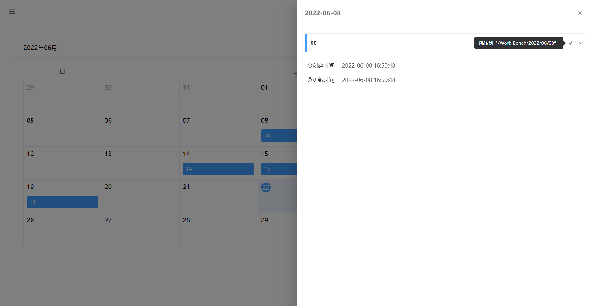

# siyuan-calendar 日历挂件

## 简介

一款简洁的日历挂件，初心是用来方便在每日笔记间快速跳转的

## 配置

笔记本需要配置 日记 **存放路径**（如果需要不显示某个笔记本可以留空）

## 功能

两种模式

- 每日笔记模式
  - 日期单元格内显示的是当天创建的笔记
  - 理论上支持 8 种每日笔记的路径格式（指 笔记本配置中的类似 `{{now | date "2006/01"}}` 语法）
    - `/prefix/YYYY/YYYY-MM-DD`  或  `/YYYY/YYYY-MM-DD`
    - `/prefix/YYYY/MM/YYYY-MM-DD` 或 `/YYYY/MM/YYYY-MM-DD`
    - `/prefix/YYYY/MM-DD` 或 `/YYYY/MM-DD`
    - `/prefix/YYYY/MM/DD` 或 `/YYYY/MM/DD`
  - `prefix` 指的是 路径前缀  类似  `/Work Bench/{{now | date "2006/01"}}/{{now | date "02"}}` 中的 Work Bench
  - 另外 YYYY MM DD 指的就是 年（2006） 月（01） 日（02）了
  - 推荐 `/prefix/YYYY/MM/DD` ，其他稀奇古怪的路径格式后续也不会再兼容了
- 事项模式
  - 日期单元格内显示的是当天创建的 顶级的 任务列表块 
  - 红色条目代表未完成，绿色条目表示已完成
